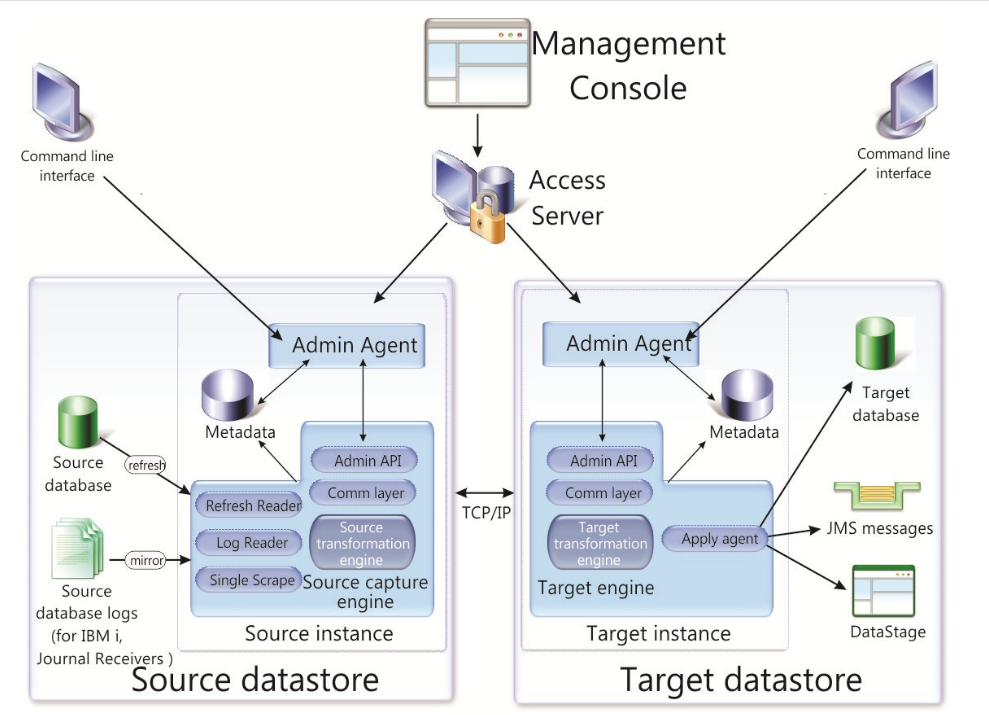

Overview of CDC Replication
============================

Descripción general de la replicación de CDC
IBM® IBM Data Replication - CDC Replication es una solución de replicación que captura los cambios de la base de datos a medida que ocurren y los entrega a bases de datos de destino, colas de mensajes o una solución ETL como IBM DataStage® basada en asignaciones de tablas configuradas en IBM Data Replication Management Console Aplicación GUI.

CDC Replication proporciona captura de bajo impacto y entrega rápida de cambios de datos para iniciativas clave de administración de información, incluyendo almacenamiento de datos dinámicos, administración de datos maestros, consolidaciones o migraciones de aplicaciones, BI operacional y habilitación de proyectos SOA. La replicación de CDC también ayuda a reducir los gastos generales de procesamiento y el tráfico de red al enviar solo los datos que han cambiado. La replicación se puede realizar de forma continua o periódica. Cuando los datos se transfieren desde un servidor de origen, se pueden reasignar o transformar en el entorno de destino.

El siguiente diagrama ilustra los componentes clave de la replicación de CDC.

Los componentes clave de la arquitectura de IBM Data Replication se describen en la siguiente lista:

**Access Server:** controla todo el acceso sin línea de comandos al entorno de replicación. Cuando inicia sesión en Management Console, se está conectando a Access Server. Access Server se puede cerrar en la estación de trabajo del cliente sin afectar las actividades de replicación de datos activas entre los servidores de origen y de destino.

**Admin API:** funciona como una interfaz de programación opcional basada en Java ™ que puede utilizar para crear secuencias de comandos de configuraciones operativas o interacciones.

**Apply agent:** actúa como el agente en el destino que procesa los cambios enviados por el origen.

**Command line interface:** le permite iniciar, detener y controlar el motor de replicación de CDC mediante las herramientas de línea de comandos del motor.

**Communication Layer (TCP/IP):** actúa como la conexión de red dedicada entre el origen y el destino.
Almacén de datos de origen y destino: representa los archivos de datos y las instancias de replicación de CDC necesarios para la replicación de datos. Cada almacén de datos representa una base de datos a la que desea conectarse y actúa como un contenedor para sus tablas. Las tablas disponibles para la replicación se encuentran en un almacén de datos.

**Source and Target Datastore:** representa los archivos de datos y las instancias de replicación de CDC necesarios para la replicación de datos. Cada almacén de datos representa una base de datos a la que desea conectarse y actúa como un contenedor para sus tablas. Las tablas disponibles para la replicación se encuentran en un almacén de datos.

**Management Console:** le permite configurar, monitorear y administrar la replicación en varios servidores, especificar parámetros de replicación e iniciar operaciones de actualización y duplicación desde una estación de trabajo cliente. Management Console también le permite monitorear las operaciones de replicación, la latencia, los mensajes de eventos y otras estadísticas admitidas por el almacén de datos de origen o de destino. El monitor en Management Console está diseñado para entornos de trabajo en los que el tiempo es crítico y que requieren un análisis continuo del movimiento de datos. CHCCLP (el procesador de línea de comandos) y las aplicaciones basadas en API también se pueden usar para configurar, monitorear y administrar la replicación a través de Access Server. Una vez que haya configurado la replicación, Management Console se puede cerrar en la estación de trabajo del cliente sin afectar las actividades de replicación de datos activa entre los servidores de origen y destino.

**Metadata:** representa la información sobre las tablas, asignaciones, suscripciones, notificaciones, eventos y otros detalles relevantes de una instancia de replicación de datos que configure.

**Mirror:** realiza la replicación de cambios en la tabla de destino o la acumulación de cambios en la tabla de origen que se utilizan para replicar los cambios en la tabla de destino en un momento posterior. Si ha implementado la replicación bidireccional en su entorno, la duplicación puede ocurrir hacia y desde las tablas de origen y de destino.

**Refresh:** realiza la sincronización inicial de las tablas de la base de datos de origen al destino. Esto lo lee el lector de actualización.

**Replication Engine:** sirve para enviar y recibir datos. El proceso que envía los datos replicados es el motor de captura de origen y el proceso que recibe los datos replicados es el motor de destino. Una instancia de réplica de CDC puede funcionar como motor de captura de origen y motor de destino simultáneamente.

**Single Scrape:** actúa como un lector de registros de solo origen y un componente analizador de registros. Comprueba y analiza los registros de la base de datos de origen para todas las suscripciones en el almacén de datos seleccionado.
No todos los motores de replicación de CDC utilizan Single Scrape. Para CDC Replication Engine para Db2® para i, hay un trabajo Scraper (que actúa como un lector de registro) y un trabajo Mirror que realiza la función de duplicación.

**Source transformation engine:** procesa el filtrado de filas, las columnas críticas, el filtrado de columnas, las conversiones de codificación y otros datos para propagarlos al motor del almacén de datos de destino.

**Source database logs:** los mantiene la base de datos de origen para sus propios fines de recuperación. El lector de registro de replicación de CDC los inspecciona en el proceso de replicación, pero filtra las tablas que no están dentro del alcance de la replicación.

**Target transformation engine:** procesa traducciones de datos y valores, conversiones de codificación, salidas de usuarios, detecciones de conflictos y otros datos en el motor de almacén de datos de destino.

Hay dos tipos de destinos de replicación solo de destino que no son bases de datos:

**JMS Messages:** actúa como un destino de mensaje JMS (cola o tema) para operaciones de nivel de fila que se crean como documentos XML.

**IBM DataStage:** procesa los cambios entregados desde la réplica de CDC que pueden utilizar los trabajos de IBM DataStage.
