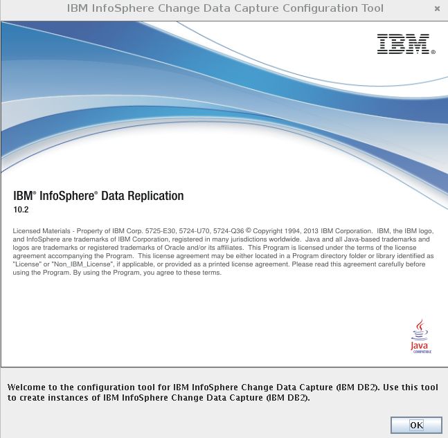
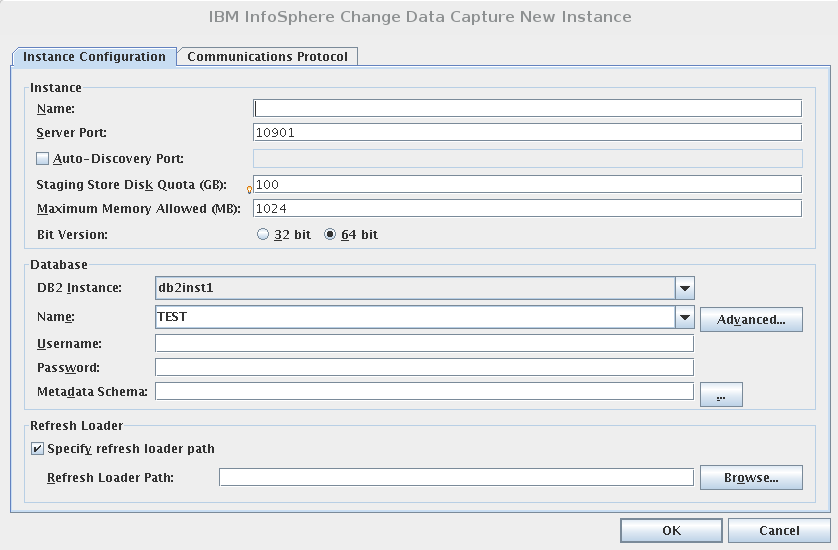
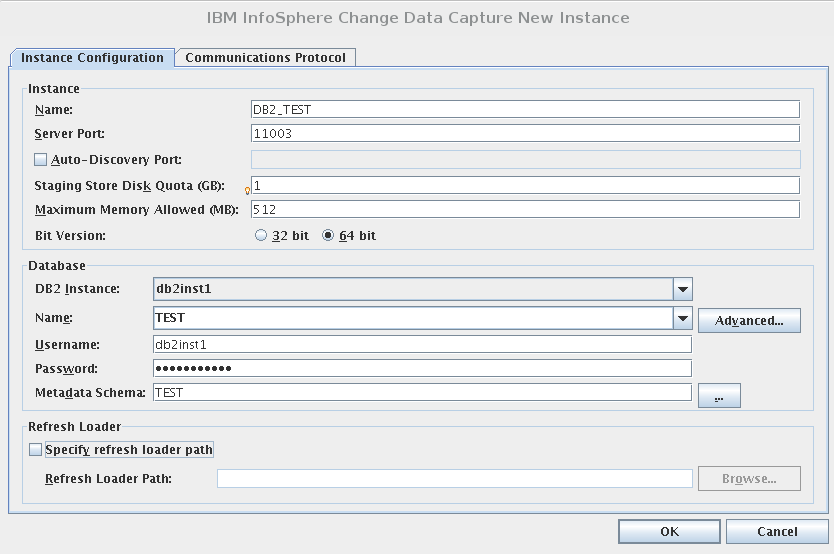
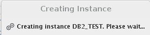

Instalar Replication engine for DB2 Linux UNIX Windows
=========================================================

Descargar el Access Server que se requiera en este caso sera el 11.3
http://www-01.ibm.com/support/docview.wss?uid=swg24038293

Prerequisitos.::

	# yum --disablerepo=\* --enablerepo=c6-media install basic-desktop glibc.i686 compat-libstdc++-33.i686

Se requiere las librerias de runtime de i686, para CDC 11.3.3 ya corrigen este detalle.::

	# instalar=`yum --disablerepo=\* --enablerepo=c6-media search X11 | grep i686 | grep runtime | awk -F":" '{print $1}'`		
	# echo $instalar libICE.i686 libICE.x86_64 libSM.i686 libSM.x86_64 libXScrnSaver.i686 libXScrnSaver.x86_64 libXext.i686 libXext.x86_64 libXfont.i686 libXfont.x86_64 libXft.i686 libXft.x86_64 libXi.i686 libXi.x86_64 libXinerama.i686 libXinerama.x86_64 libXmu.i686 libXmu.x86_64 libXp.i686 libXp.x86_64 libXpm.i686 libXpm.x86_64 libXrandr.i686 libXrandr.x86_64 libXrender.i686 libXrender.x86_64 libXt.i686 libXt.x86_64 libXtst.i686 libXtst.x86_64 libXv.i686 libXv.x86_64 libXvMC.i686 libXvMC.x86_64 libXxf86dga.i686 libXxf86dga.x86_64 libXxf86misc.i686 libXxf86misc.x86_64 libXxf86vm.i686 libXxf86vm.x86_64 libdmx.i686 libdmx.x86_64 libfontenc.i686 libfontenc.x86_64 libxkbfile.i686 libxkbfile.x86_64
		# yum --disablerepo=\* --enablerepo=c6-media install $instalar

Descomprimir el paquete.::

	# unzip IIDRCDC_10.2.1_DB2_Lnx_x86.zip

Instalamos.::

	# ls -l
	total 186236
	drwxr-xr-x. 2 root     root          4096 nov  8  2013 IIDR_1021_DB2LUW
	-rw-r-----. 1 root     root     190669049 sep 26 19:13 IIDRCDC_10.2.1_DB2_Lnx_x86.zip

	# cd IIDR_1021_DB2LUW/

	]# ls -l
	total 186872
	-rw-r--r--. 1 root root     24305 nov  8  2013 InfoSphereDataReplication_Release_Notes_1021_CDC_DB2LUW.html
	-rw-r--r--. 1 root root 191329196 nov  8  2013 setup-cdc-linux-x86-db2luw.bin

	# chmod +x setup-cdc-linux-x86-db2luw.bin

.::

	# ./setup-cdc-linux-x86-db2luw.bin 
	Preparing to install...
	Extracting the JRE from the installer archive...
	Unpacking the JRE...
	Extracting the installation resources from the installer archive...
	Configuring the installer for this system's environment...

	Launching installer...

	===============================================================================
	Installer                                        (created with InstallAnywhere)
	-------------------------------------------------------------------------------

	Preparing CONSOLE Mode Installation...

	===============================================================================
	Introduction
	------------

	InstallAnywhere will guide you through the installation of IBM InfoSphere 
	Change Data Capture (IBM DB2) 10.2

	Respond to each prompt to proceed to the next step in the installation.  If you
	want to change something on a previous step, type 'back'.

	You may cancel this installation at any time by typing 'quit'.

	PRESS <ENTER> TO CONTINUE: 

	===============================================================================

	 
	 
		Acuerdo Internacional de Programas bajo Licencia
		
		Parte 1 - Condiciones Generales
		
		EL LICENCIATARIO ACEPTA LOS TÉRMINOS DE ESTE ACUERDO MEDIANTE LA
		DESCARGA, INSTALACIÓN, COPIA, ACCESO, PULSANDO EL BOTÓN "ACEPTAR" O
		MEDIANTE CUALQUIER TIPO DE UTILIZACIÓN DEL PROGRAMA. SI EL CLIENTE
		ACEPTA ESTOS TÉRMINOS EN NOMBRE DEL LICENCIATARIO, EL CLIENTE DECLARA
		Y GARANTIZA QUE TIENE PLENA AUTORIDAD PARA OBLIGAR AL LICENCIATARIO A
		CUMPLIR DICHOS TÉRMINOS. SI EL CLIENTE NO ACEPTA ESTOS TÉRMINOS, NO
		DEBERÁ
		
		* DESCARGAR, INSTALAR, COPIAR, ACCEDER, PULSAR EL BOTÓN "ACEPTAR" NI
		USAR EL PROGRAMA; Y DEBERÁ
		
		* DEVOLVER INMEDIATAMENTE LOS MEDIOS NO UTILIZADOS, LA DOCUMENTACIÓN Y
		EL DOCUMENTO DE TITULARIDAD A LA ENTIDAD A LA CUAL LOS ADQUIRIÓ PARA
		EL REEMBOLSO DEL IMPORTE PAGADO. SI EL PROGRAMA FUE DESCARGADO,
	 
	Pulse Intro para seguir visualizando el acuerdo de licencia, o entre "1" 
	   para aceptar el acuerdo, "2" para no aceptarlo, "3" para imprimirlo, "5" 
	   para visualizarlo en inglés, o "99" para volver a la pantalla anterior.: 1

	===============================================================================
	Choose Install Folder
	---------------------

	Where would you like to install?

	  Default Install Folder: /opt/IBM/InfoSphereChangeDataCapture/ReplicationEngineforIBMDB2

	ENTER AN ABSOLUTE PATH, OR PRESS <ENTER> TO ACCEPT THE DEFAULT
		  : /opt/TS_Agents_DB2

	INSTALL FOLDER IS: /opt/TS_Agents_DB2
	   IS THIS CORRECT? (Y/N): y

	===============================================================================
	Pre-Installation Summary
	------------------------

	Please Review the Following Before Continuing:

	Product Name:
		IBM InfoSphere Change Data Capture (IBM DB2)

	Install Folder:
		/opt/TS_Agents_DB2

	Link Folder:
		/tmp/install.dir.6887/Do_Not_Install

	Disk Space Information (for Installation Target): 
		Required:  384.744.398 Bytes
		Available: 1.459.994.624 Bytes

	PRESS <ENTER> TO CONTINUE: 

	===============================================================================
	Installing...
	-------------

	 [==================|==================|==================|==================]
	 [------------------|------------------|------------------|------------------]

	===============================================================================
	Install Complete
	----------------

	Congratulations. IBM InfoSphere Change Data Capture (IBM DB2) has been successfully installed to:
	   /opt/TS_Agents_DB2

	You can launch the Configuration Tool at any time by running
	   /opt/TS_Agents_DB2/bin/dmconfigurets

	Launch Configuration Tool? (1=Yes, 2=No) (DEFAULT: 1): 2

Nos aseguramos que nuestra conexion SSH tenga el forwarding de las X. o conectamos nuevamente.::

	$ ssh -X root@192.168.56.11

Ahora si podemos ejecutar la herramienta de configuracion .::

   # /opt/TS_Agents_DB2/bin/dmconfigurets

Iniciar un agente

$ /opt/TS_agents_target/bin/dmts64 -I agent_target &

