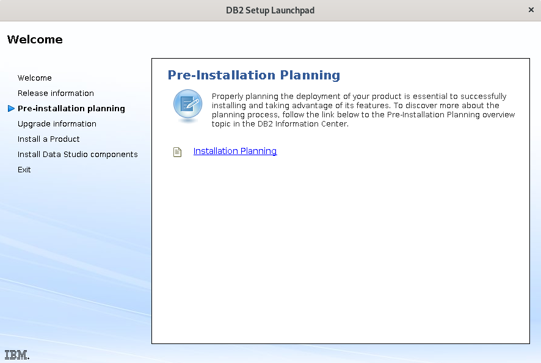
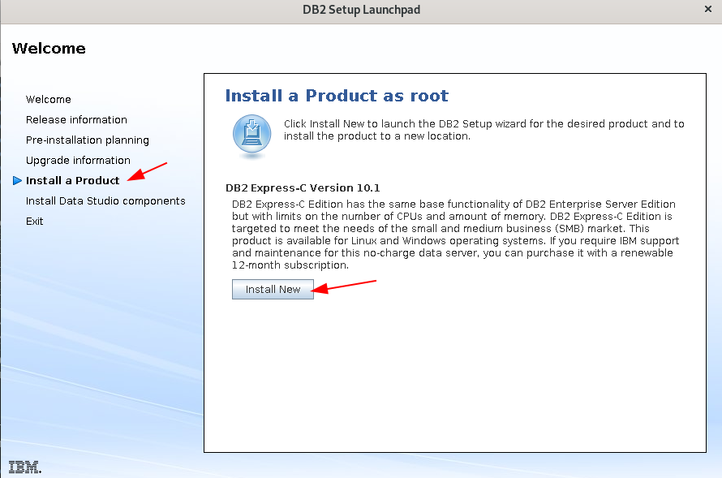

Instalar Access Server
========================

Vamos a instalar el manejador de Base de Datos de IBM DB2 10.1 express...!!! Lo primero que debemos hacer es iniciar en nuestro servidor con ssh -X para que tengamos el Forwarding de las X11::

	ssh -X root@192.168.1.100

Instalamos prerrequisitos::

	# yum -y install compat-libstdc++-33 libXtst

Creamos el home directory en donde estará los archivos y configuración para instanciar la BD de DB2::

	# mkdir /db2home

Debemos tener el instalador de IBM DB2 10.1 express que es **db2_v101_linuxx64_expc_lite.tar.gz**

	# ls -l db2_v101_linuxx64_expc_lite.tar.gz

Descomprimimos el paquete en donde esta el instalador de IBM DB2 10.1::

	# tar xvzf db2_v101_linuxx64_expc_lite.tar.gz

Ingresamos en la carpeta descomprimida hasta llegar en donde estan los instaladores::

	# cd devinst/db2_galileo/linuxamd64/s120403/expc_lite/d

	# ls 
	db2  db2ckupgrade  db2_deinstall  db2_install  db2ls  db2prereqcheck  db2setup

Procedemos con la instalación::

	# ./db2setup 
	DBI1190I  db2setup is preparing the DB2 Setup wizard which will guide
	      you through the program setup process. Please wait.

Al ejecutar el comando y si tenemos bien configurada el forwarding de las X11 veremos una ventana como las siguientes en las cuales podemos ir interactuando con ella, en nuestro caso vamos a seleccionar **Install Product**

.. figure:: ../images/101/01.png

.. figure:: ../images/101/06.png

