Instalar Management Console
====================

Descargar el Management Console que se requiera en este caso sera el 11.3, part number CN0GFML

http://www-01.ibm.com/support/docview.wss?uid=swg24038293

Este componente IBM Management Console de CDC, lo vamos a instalar en la otra maquina virtual con Windows. Esta Maquina Virtual unicamente tiene la instalación de Windows 10, con 2Gb de RAM, HDD de 60Gb, Adaptador tipo Bridge.

Copiamos dentro del equipos con windows el instalador IDR11.3_CDC_MANAGEMT_CNSL_WIN_ML.zip, lo descomprimimos y lo instalamos, es puro NEXT.

Ejecutamos el siguiente Icono:

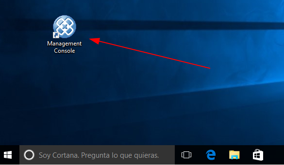

En esta ventana debemos colocar el usuario y la clave cuando ejecutamos el comando de configuracion del Access Server, también colocamos la IP del Servidor en donde instalamos el Access Server y el Puerto que configuramos::

	/opt/TS_AccessServer/bin/dmcreateuser admin User_Admin Usuario_Administrador Venezuela21 SYSADMIN TRUE TRUE FALSE

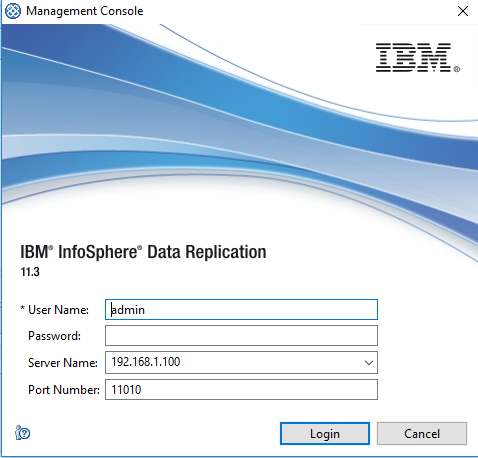

Como es primera vez que iniciamos sesión, nos obliga a cambiar la clave.

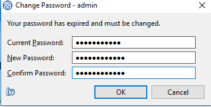

Ya podemos ingresar con la nueva clave y esta sera el área de trabajo.

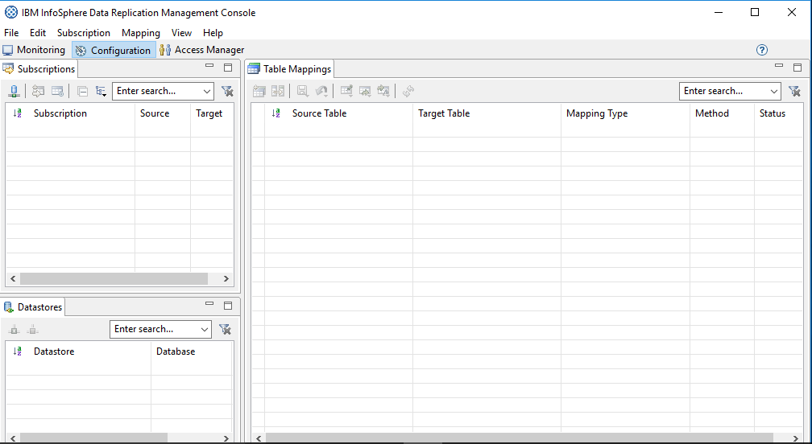

Lo primero que debemos hacer es configurar los DataStore, es aquí en donde le indicamos al Access Server por medio del Management Console como se va conectar con los Agentes de CDC. Para eso nos vamos a la pestaña de **Access Manager**

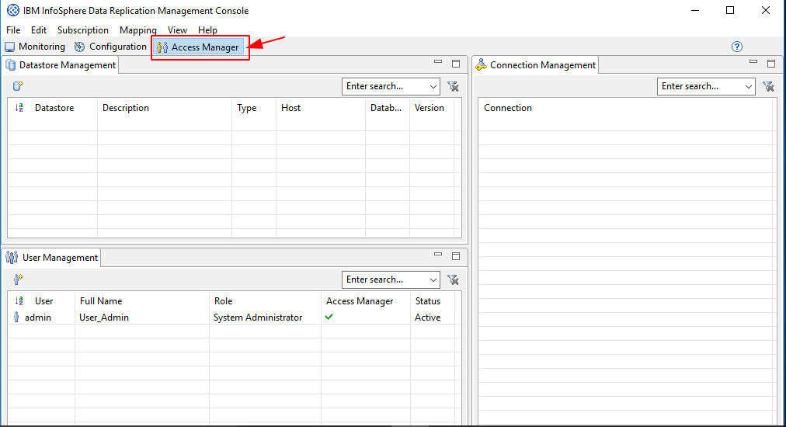

**Configurando el Datastore para el DB2**

En el área de trabajo le damos clic derecho y seleccionamos **New Datastore**

Nos Trae la siguiente ventana y la completamos los campos de **Identification** luego le damos click al boton **Ping** y el nos completa la información en **Properties**

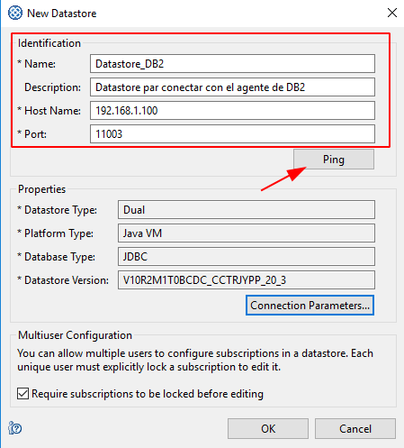

Luego en esa misma ventana debemos pulsar sobre el boton **Connection Parameters** IMPORTANTE nunca olvidar esta configuración porque aquí se le debe colocar el usuario y clave de la BD

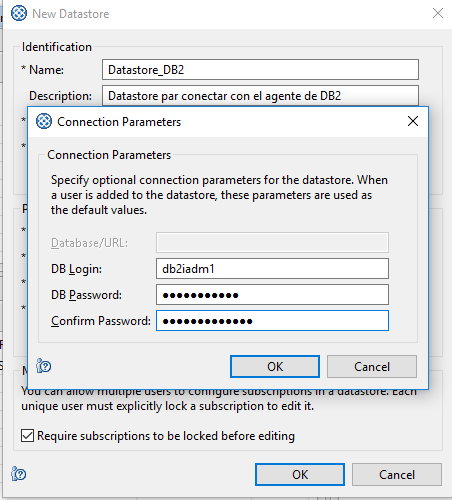

Veremos los siguiente en el area de trabajo de la pestaña de **Access Manager**

.. figure:: ../images/mc/09.png

Hacemos clic derecho sobre el Datastore creado  y seleccionamos **Assing User**, esto le dará permisos a los usuarios que creemos que puedan ver y/o administra este Datastore.

.. figure:: ../images/mc/10.png

Seleccionamos los usuarios que se requieran, en este ejemplo solo tenemos uno creado.

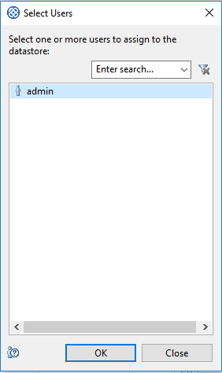

Nos pide la confirmación, simplemente le damos al boton **Aceptar**

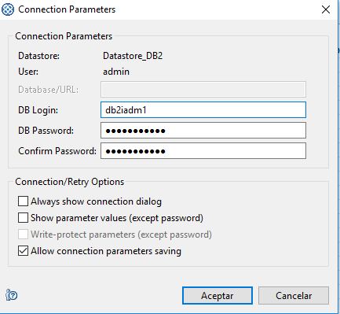

Ahora vemos como ya esta asignado el usuario admin para que pueda utilizar este Datasource

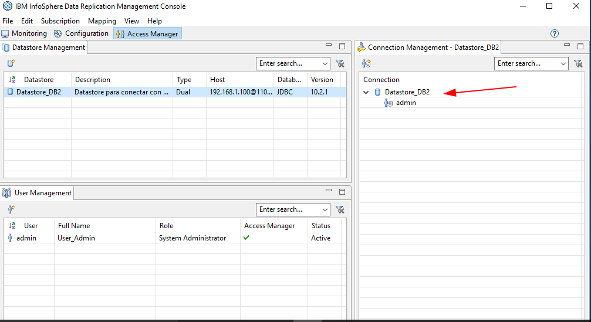

repetimos todos los pasos anteriores, pero ahora para conectar el DataStore de Oracle

**Configurando el Datastore para el Oralce**

En el área de trabajo le damos clic derecho y seleccionamos **New Datastore**

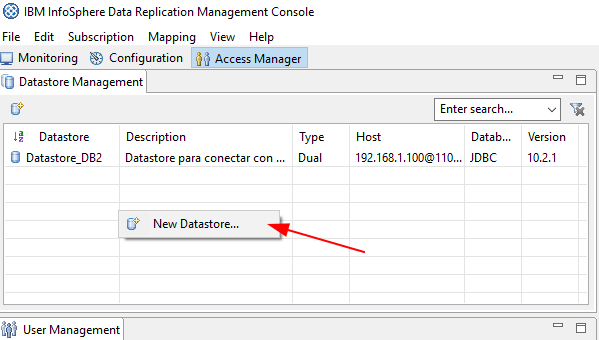

Nos Trae la siguiente ventana y la completamos los campos de **Identification** luego le damos click al boton **Ping** y el nos completa la información en **Properties**

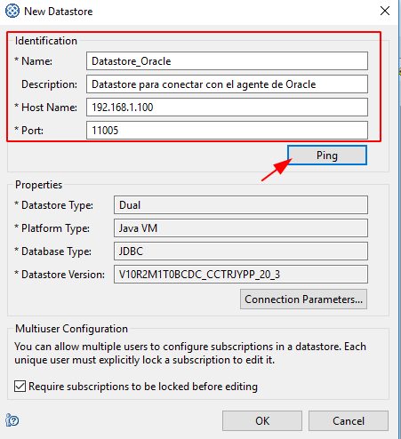

Luego en esa misma ventana debemos pulsar sobre el boton **Connection Parameters** IMPORTANTE nunca olvidar esta configuración porque aquí se le debe colocar el usuario y clave de la BD de Oracle

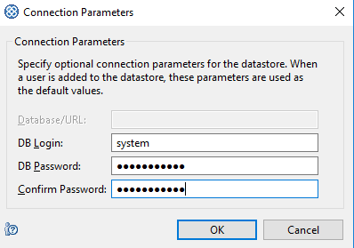

Veremos los siguiente en el área de trabajo de la pestaña de **Access Manager**

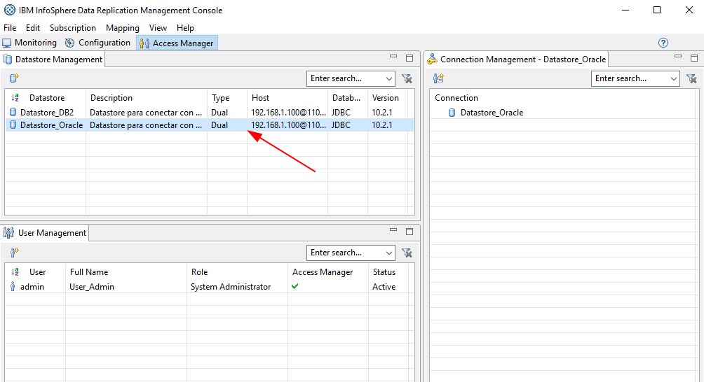

Hacemos clic derecho sobre el Datastore creado y seleccionamos **Assing User**, esto le dará permisos a los usuarios que creemos que puedan ver y/o administra este Datastore.

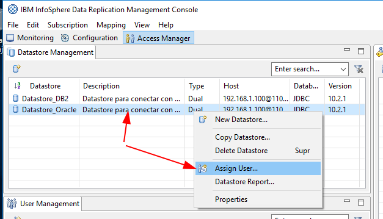

Seleccionamos los usuarios que se requieran, en este ejemplo solo tenemos uno creado.

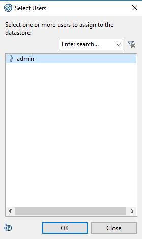

Nos pide la confirmación, simplemente le damos al boton **Aceptar**

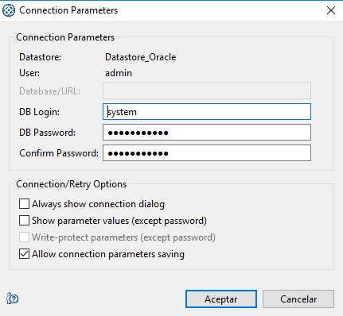

Ahora vemos como ya esta asignado el usuario admin para que pueda utilizar este Datasource

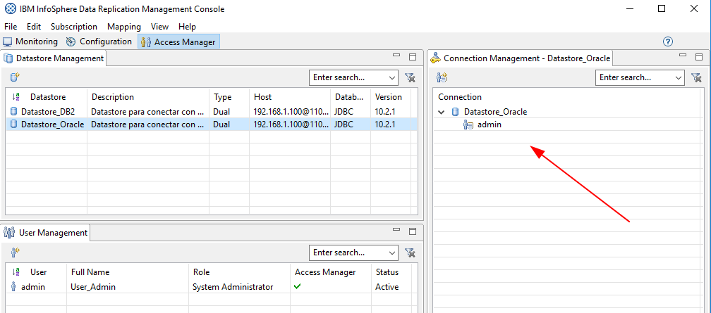

