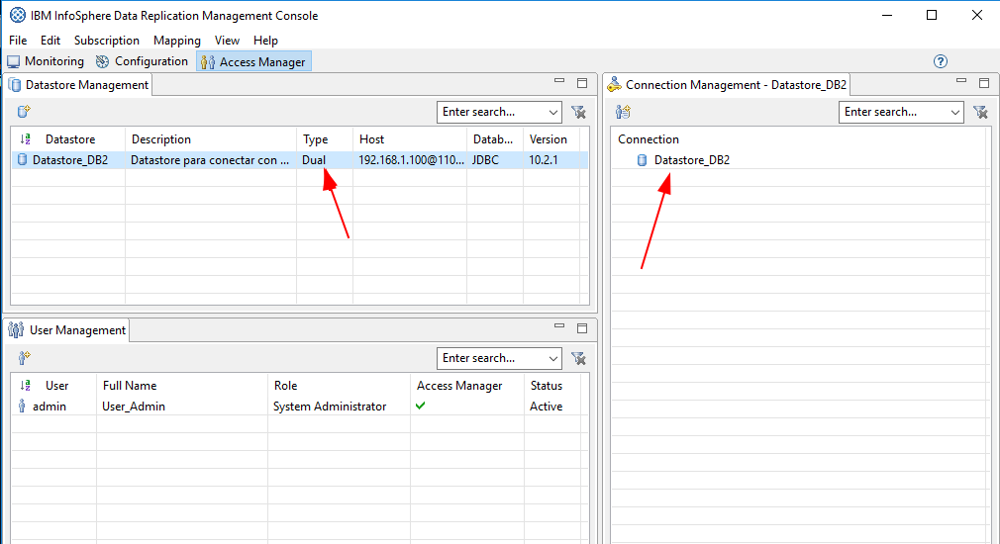
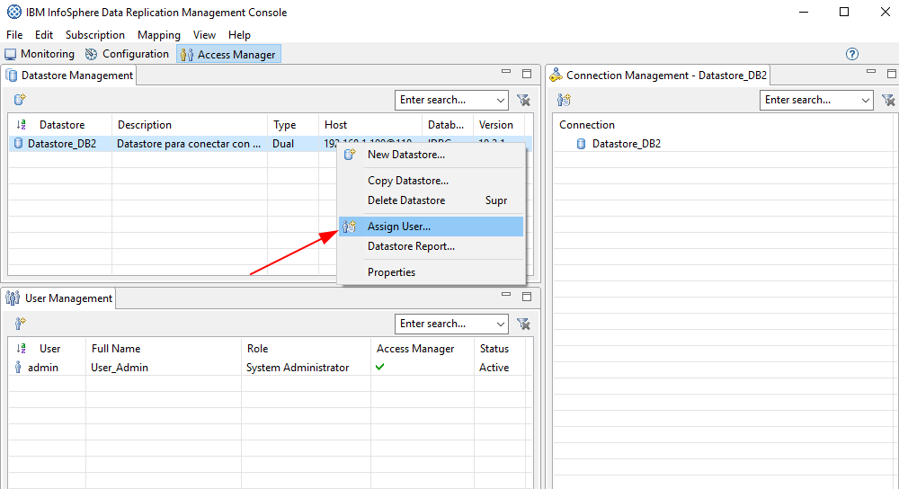
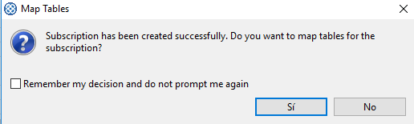

Instalar Management Console
====================

Descargar el Management Console que se requiera en este caso sera el 11.3, part number CN0GFML

http://www-01.ibm.com/support/docview.wss?uid=swg24038293

Este componente IBM Management Console de CDC, lo vamos a instalar en la otra maquina virtual con Windows. Esta Maquina Virtual unicamente tiene la instalación de Windows 10, con 2Gb de RAM, HDD de 60Gb, Adaptador tipo Bridge.

Copiamos dentro del equipos con windows el instalador IDR11.3_CDC_MANAGEMT_CNSL_WIN_ML.zip, lo descomprimimos y lo instalamos, es puro NEXT.

Ejecutamos el siguiente Icono:

En esta ventana debemos colocar el usuario y la clave cuando ejecutamos el comando de configuracion del Access Server, también colocamos la IP del Servidor en donde instalamos el Access Server y el Puerto que configuramos::

	/opt/TS_AccessServer/bin/dmcreateuser admin User_Admin Usuario_Administrador Venezuela21 SYSADMIN TRUE TRUE FALSE

Como es primera vez que iniciamos sesión, nos obliga a cambiar la clave.

.. figure:: ../images/mc/03.png

Ya podemos ingresar con la nueva clave y esta sera el área de trabajo.

Creando los Datastore
++++++++++++++++++++++++

Lo primero que debemos hacer es configurar los DataStore, es aquí en donde le indicamos al Access Server por medio del Management Console como se va conectar con los Agentes de CDC. Para eso nos vamos a la pestaña de **Access Manager**

**Configurando el Datastore para el DB2**

En el área de trabajo le damos clic derecho y seleccionamos **New Datastore**

.. figure:: ../images/mc/05.png

Nos Trae la siguiente ventana y completamos los campos de **Identification** luego le damos click al boton **Ping** y el nos completa la información en **Properties**

Luego en esa misma ventana debemos pulsar sobre el boton **Connection Parameters** IMPORTANTE nunca olvidar esta configuración porque aquí se debe colocar el usuario y clave de la BD del DB2.

Veremos lo siguiente en el area de trabajo de la pestaña de **Access Manager**

Hacemos clic derecho sobre el Datastore creado  y seleccionamos **Assing User**, esto le dará permisos a los usuarios que creemos que puedan ver y/o administra este Datastore.

Seleccionamos los usuarios que se requieran, en este ejemplo solo tenemos uno creado.

.. figure:: ../images/mc/11.png

Nos pide la confirmación, simplemente le damos al boton **Aceptar**

.. figure:: ../images/mc/12.png

Ahora vemos como ya esta asignado el usuario admin para que pueda utilizar este Datasource

repetimos todos los pasos anteriores, pero ahora para conectar el DataStore de Oracle

**Configurando el Datastore para el Oralce**

En el área de trabajo le damos clic derecho y seleccionamos **New Datastore**

Nos Trae la siguiente ventana y la completamos los campos de **Identification** luego le damos click al boton **Ping** y el nos completa la información en **Properties**

.. figure:: ../images/mc/15.png

Luego en esa misma ventana debemos pulsar sobre el boton **Connection Parameters** IMPORTANTE nunca olvidar esta configuración porque aquí se debe colocar el usuario y clave de la BD de Oracle

.. figure:: ../images/mc/16.png

Veremos lo siguiente en el área de trabajo de la pestaña de **Access Manager**

.. figure:: ../images/mc/17.png

Hacemos clic derecho sobre el Datastore creado y seleccionamos **Assing User**, esto le dará permisos a los usuarios que creemos que puedan ver y/o administra este Datastore.

Seleccionamos los usuarios que se requieran, en este ejemplo solo tenemos uno creado.

Nos pide la confirmación, simplemente le damos al boton **Aceptar**

.. figure:: ../images/mc/20.png

Ahora vemos como ya esta asignado el usuario admin para que pueda utilizar este Datasource

Creando una subscripción
++++++++++++++++++++++++++

Nos vamos a la pestaña **Configuration** y en el área de trabajo le damos boton derecho y seleccionamos **New Subscription**

Trae la siguiente ventana y debemos completar los datos, Debemos ya tener claros desde que tabal va leer los datos y hacia que tabla los va replicar. En este ejemplo el Origen es la BD DB2 y el destino sera el Oracle.

Le decimos que si.

Procedemos a configurar el Mapping Type, lo dejamos por defecto, que es el mas utilizado.

Como vemos nos trae la información del Datastore_DB2 el cual esta asociado a la BD del DB2.

Debemos buscar el schema y seleccionar la tabla que queremos replicar.

El CDC puede crear la tabla en el destino o utilizar una que ya exista, en este punto es donde podemos seleccionar cual utilizar, en este ejemplo vamos a decirle que cree una nueva en el destino.

Aquí debemos seleccionar el Schema del destino en donde se va replicar, por supuesto que debemos ya tener claro cual es el nombre del Schema Destino. Para eso le damos un click en el campo que el nos indica.

Seleccionamos el Schema y le damos okey.

Vemos como ya se completo la información y le damos siguiente.

.. figure:: ../images/mc/31.png

En la siguiente ventana podemos alterar el nombre de la tabla destino, pero vamos a decirle que utilice el mismo nombre que la de origen. Es una muy buena practica.

En la siguiente ventana, podemos indicar el tipo de replicación, si va ser **Mirror** o **Refresh**, por lo general siempre es **Mirror**, se puede tomar como premisa utilizar **Refresh** si siempre en el destino truncan la tabla.

Nos muestra el review y le damos finalizar.

Falto la imagen donde muestra el Review

Inicia el proceso de creación de la Subscription.

Ahora en el área de trabajo podemos ver como se creo la subscription, aun estamos en la pestaña **Configuration**, vemos en el TAB de **Subscription** el nombre de la subscriptcion el Datasource de Origen y destino. En el TAB **Table Mappings** tenemos mas detalle de la subscription como :

Source Table

Target Table

Mapping Type

Method

Status

Ahora para finalizar nos vamos a la pestaña **Monitoring** **Subscriptions** y en el TAB **Subscriptions** desde ahí vemos el status de la subscription y podemos ver que no esta iniciada, que esta inactiva. NO la iniciemos esto lo hacemos en otro capitulo de Troubleshooting.

