Troubleshooting
===============

En el laboratorio anterior solo llegamos hasta crear la Subscription y la dejamos **inactive**, recordemos que  seleccionamos una tabla en la BD de Origen y le indicamos que creara una tabla con el mismo nombre en la BD Destino.

Iniciar la Subscripción. Ver como inicialmente se pone en **Refresh** y luego se queda en **Mirror**.
Verificar que los registros de la Tabla en la BD Origen se hayan replicado en la Tabla en la BD Destino.
Verificar que ambas tablas tengan la misma cantidad de registros.
Agregar nuevos registros en la Tabla de la BD Origen.
Certificar que los nuevos registros se hayan replicado en la Tabla en la BD Destino.
Truncar la Tabla de la BD de Destino.
Analizar que la Subscripción, se mantiene en **Mirror**
Agregar nuevos registros en la Tabla de la BD Origen.
Certificar que los nuevos registros se hayan replicado en la Tabla en la BD Destino.
Como se detalla los registros anteriores no se observan, solo los nuevos.
Detener la Subscripción e iniciarla en **Refresh**, observar como se trae todos los registros nuevamente y luego se queda en **Mirror**.

Lo primero que debemos hacer es tener dos terminales uno conectado con la BD Origen que es DB2 y otra con la BD Destino que es Oracle.

Vamos a conectarnos al DB2::

	$ db2 connect to TEST_DB2

	   Database Connection Information

	 Database server        = DB2/LINUXX8664 10.1.0
	 SQL authorization ID   = DB2IADM1
	 Local database alias   = TEST_DB2

Consultamos el contenido de la tabla la cual es el Origen de la consulta del CDC::

	$ db2 "select * from TEST_DB2.TABLE01"

	ID          USERNAME            
	----------- --------------------
		  1 CarlGom             
		  1 LucSan              

	  2 record(s) selected.

Vemos que solo hay dos (2) registros.

Ahora nos conectamos al Oracle::

	-bash-4.2$ sqlplus system

	SQL*Plus: Release 11.2.0.2.0 Production on Sat Jun 5 06:08:19 2021

	Copyright (c) 1982, 2011, Oracle.  All rights reserved.

	Enter password: Venezuela21

	Connected to:
	Oracle Database 11g Express Edition Release 11.2.0.2.0 - 64bit Production

	SQL> 

Primero consultamos si realmente nos creo la tabla cuando creamos la Subscription::

	SQL> Select owner, table_name from dba_tables where table_name = 'TABLE01';

	OWNER			       TABLE_NAME
	------------------------------ ------------------------------
	APPS-SCHEMA		       TABLE01

Consultamos si tiene datos::

	SQL> Select * from "APPS-SCHEMA".TABLE01;

	no rows selected

Listamos números de registros::

	SQL> SELECT COUNT(*) FROM "APPS-SCHEMA".TABLE01;  

	  COUNT(*)
	----------
		 0

Vemos que la tabla esta vacía.

Ahora nos vamos al Management Console del CDC e inicializamos la Subscripción. ya sean en el icono de start o boton derecho sobre la Subscripción.

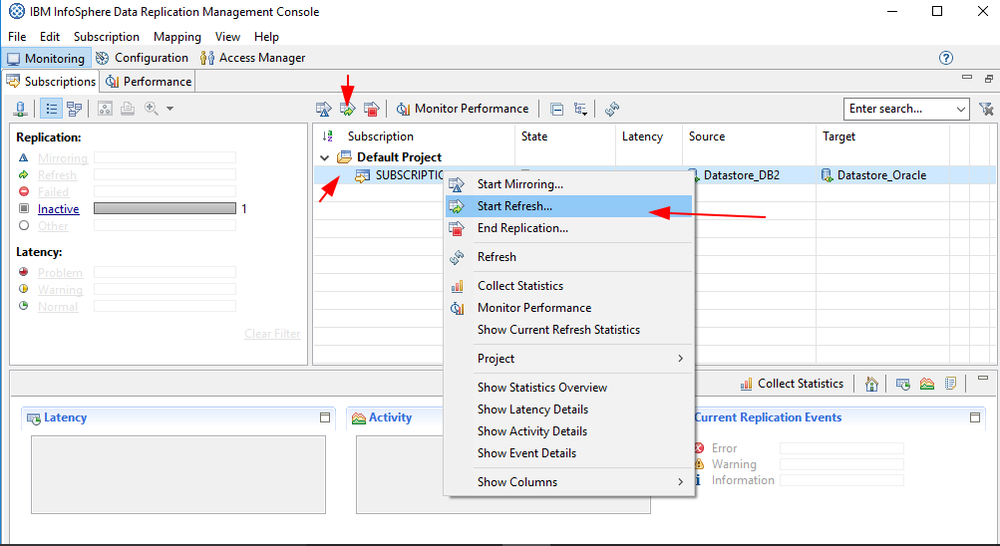

Nos pide la selección del Metodo de Replicación dejamos **Continuous**

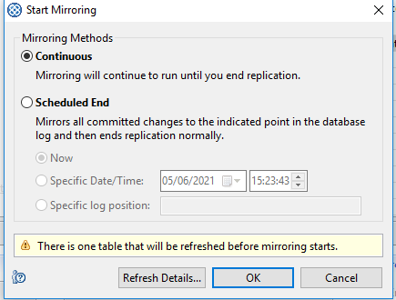

Observemos como se coloca en **Starting** en la columna **State**

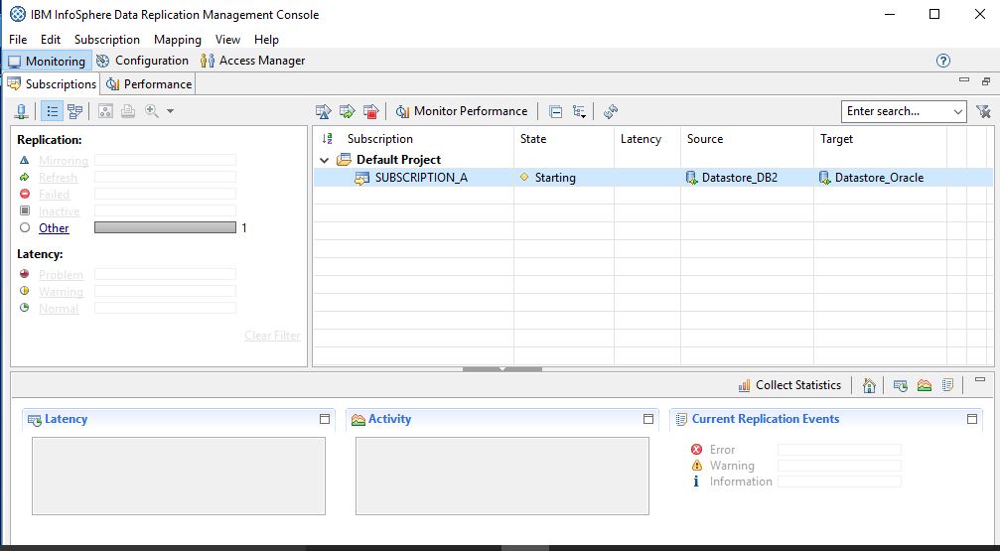

Observemos como se coloca en **Refresh Before Mirroring** en la columna **State**

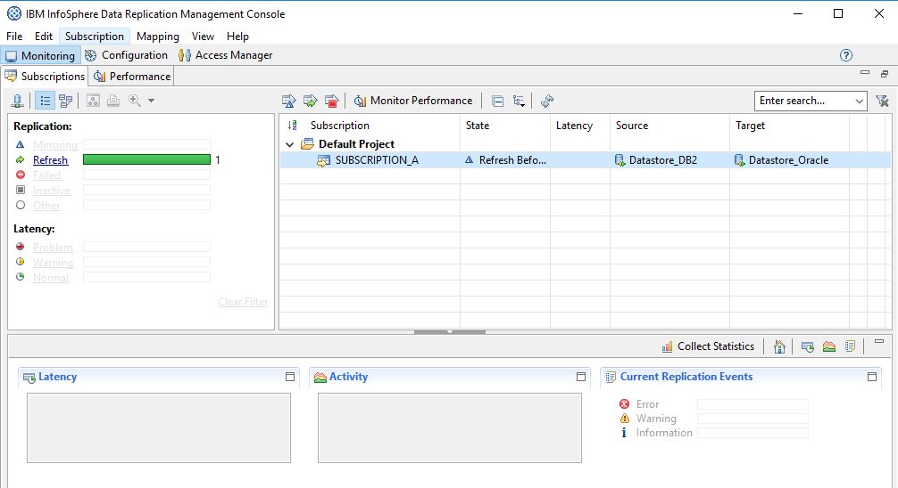

Observemos como se coloca en **Mirror Continuous** en la columna **State**

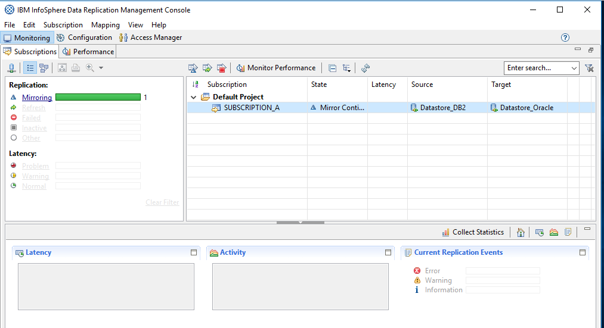

Verificar que los registros de la Tabla en la BD Origen se hayan replicado en la Tabla en la BD Destino::

	SQL> Select * from "APPS-SCHEMA".TABLE01;

		ID
	----------
	USERNAME
	--------------------------------------------------------------------------------
		 1
	CarlGom

		 1
	LucSan

Listamos números de registros::

	SQL> SELECT COUNT(*) FROM "APPS-SCHEMA".TABLE01;  

	  COUNT(*)
	----------
		 2

Agregar nuevos registros en la Tabla de la BD Origen.::

	$ db2 "INSERT INTO TEST_DB2.TABLE01 VALUES(2, 'MaEnc')"
	DB20000I  The SQL command completed successfully.

	$ db2 "INSERT INTO TEST_DB2.TABLE01 VALUES(3, 'JoOrf')"
	DB20000I  The SQL command completed successfully.

Certificar que los nuevos registros se hayan replicado en la Tabla en la BD Destino.::

	SQL> Select * from "APPS-SCHEMA".TABLE01;

		ID
	----------
	USERNAME
	--------------------------------------------------------------------------------
		 2
	MaEnc

		 3
	JoOrf

		 1
	CarlGom

		ID
	----------
	USERNAME
	--------------------------------------------------------------------------------
		 1
	LucSan

Truncar la Tabla de la BD de Destino.::

	SQL> truncate table "APPS-SCHEMA".TABLE01;  

	Table truncated.

Verificamos los registros en la Tabla de la BD Destino::

	SQL> SELECT COUNT(*) FROM "APPS-SCHEMA".TABLE01;  

	  COUNT(*)
	----------
		 0

Analizar que la Subscripción, se mantiene en **Mirror**.

Agregar nuevos registros en la Tabla de la BD Origen.::

	$ db2 "INSERT INTO TEST_DB2.TABLE01 VALUES(3, 'JoGom')"
	DB20000I  The SQL command completed successfully.

	$ db2 "INSERT INTO TEST_DB2.TABLE01 VALUES(3, 'BaGom')"
	DB20000I  The SQL command completed successfully.

	$ db2 "INSERT INTO TEST_DB2.TABLE01 VALUES(3, 'CaGom')"
	DB20000I  The SQL command completed successfully.

Certificar que los nuevos registros se hayan replicado en la Tabla en la BD Destino.::

	SQL> Select * from "APPS-SCHEMA".TABLE01;

		ID
	----------
	USERNAME
	--------------------------------------------------------------------------------
		 3
	JoGom

		 3
	BaGom

		 3
	CaGom

Como se detalla los registros anteriores no se observan, solo los nuevos.

Detener la Subscripción e iniciarla en **Refresh**, observar como se trae todos los registros nuevamente y luego se queda en **Mirror**.

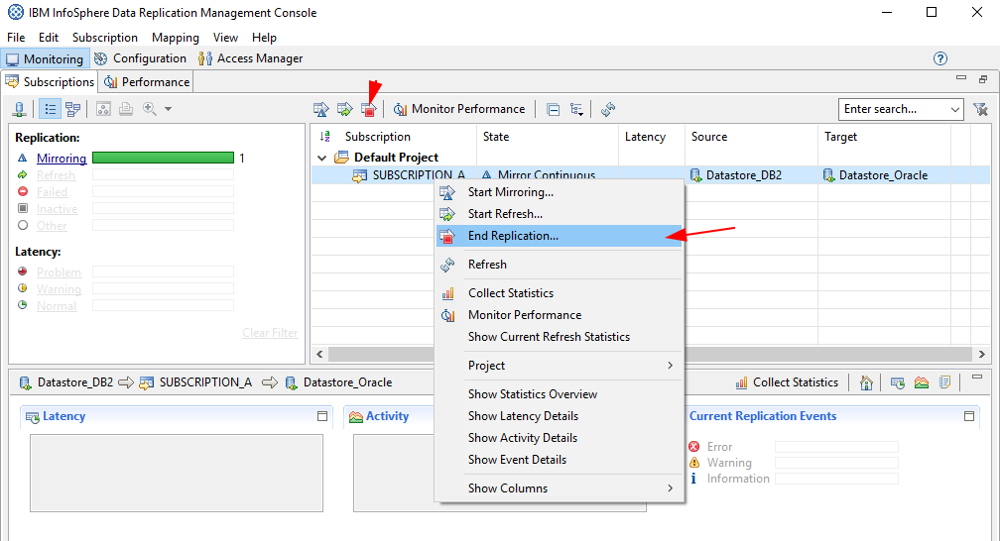

Que se detenga de forma normal.

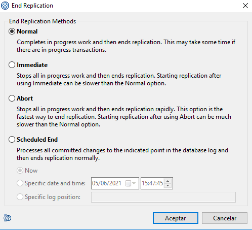

Se coloca en **Inactive**

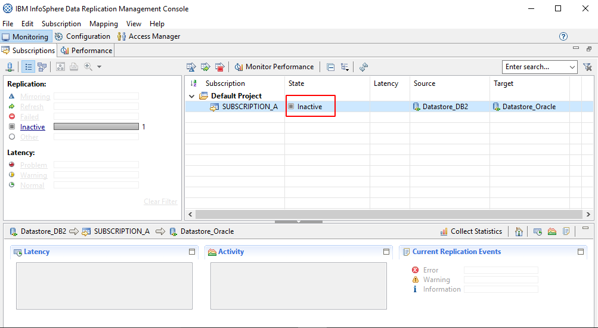

Nos vamos a la pestaña de **Configuration**, y vemos la columna **Status** que no dice que esta **Active**, esto lo que nos quiere decir es que esta en **Mirror Continuous**. Ahora seleccionamos la subscripción con botón derecho y marcamos **Flag to Refresh**

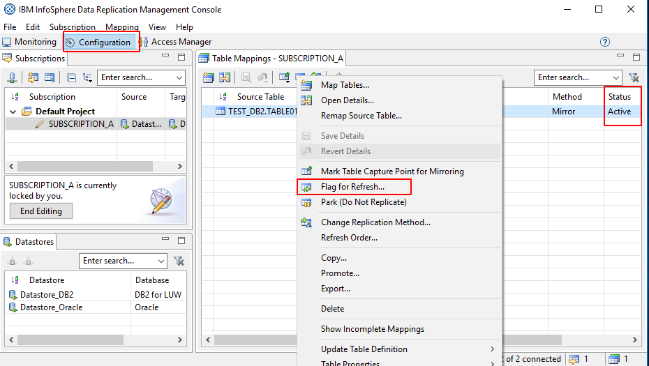

Seleccionamos **Standard Refresh**

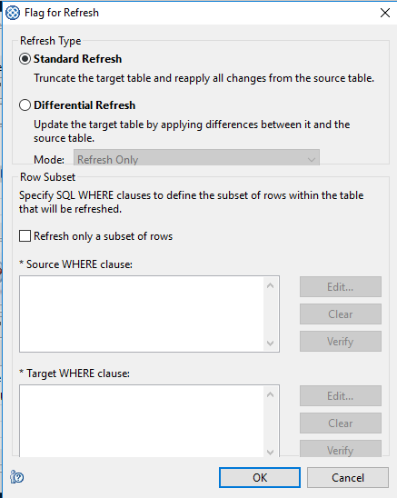

Vemos como la columna **Status** Ahora cambio a **Refresh**

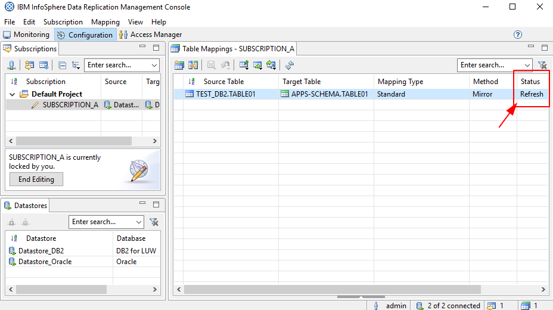

Ahora iniciamos nuevamente la Subscripción,

Nos pide la selección del Metodo de Replicación dejamos **Continuous**

Observemos como se coloca en **Starting** en la columna **State**

Observemos como se coloca en **Refresh Before Mirroring** en la columna **State**

Observemos como se coloca en **Mirror Continuous** en la columna **State**

Por ultimo verificamos cuantos registros hay en la Tabla de la BD Destino.::

	SQL> Select * from "APPS-SCHEMA".TABLE01;

		ID
	----------
	USERNAME
	--------------------------------------------------------------------------------
		 1
	CarlGom

		 1
	LucSan

		 2
	MaEnc

		ID
	----------
	USERNAME
	--------------------------------------------------------------------------------
		 3
	JoOrf

		 3
	JoGom

		 3
	BaGom

		ID
	----------
	USERNAME
	--------------------------------------------------------------------------------
		 3
	CaGom

	7 rows selected.

